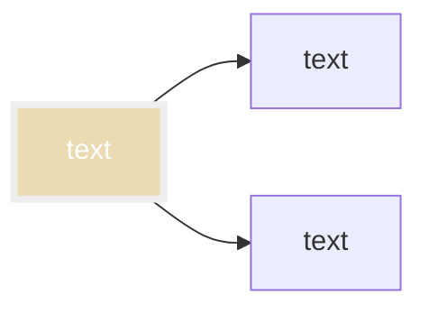

```mermaid  
graph TD;  
A-->B;  
A-->C;  
B-->D;  
C-->D;  
```

```mermaid
graph LR
	%%==============%%
	%% Declarations %%
	%%==============%%
		A[text]
		B[text]	
		C[text]
	%%=========%%
	%% Linking %%
	%%=========%%
	%% comment
	A --> B & C
	
	%% subgraph
	%% end
class A,B,C internal-link;
style A fill:#EBDBB2,stroke:#EEE,stroke-width:4px,color:#FFF
```
